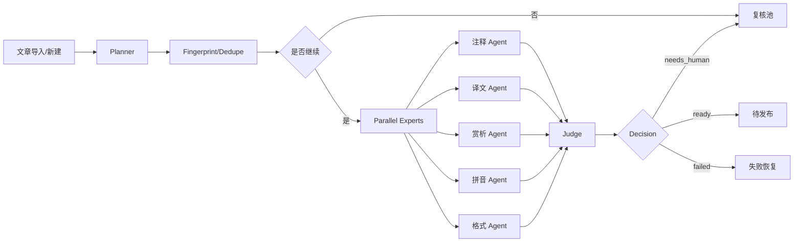

# AI Native 多 AI 协作实施方案

> 目标：把樗栎集管理从“人工点按钮”升级为“多 AI 协作的后台生产线”。
> 用途：给后续参与构建的 AI 直接接力，减少上下文损耗、重复劳动和方案偏移。

## 1. 当前状态

项目已经完成第一轮基座改造，但还不是完整 AI Native：

- 已有持久化工作流雏形：`AiWorkflowRun`、`AiWorkflowStep`
- 已有 AI 基础能力：统一校准、批量辅助、拼音校准、校审、去重
- 已接入自动入队：导入和新建樗栎集文章后可自动创建 workflow
- 已有后台入口：列表页 AI 状态、手动推进 worker、任务查询
- 仍然存在的问题：worker 级别不够细、缺少锁和恢复、缺少 artifact 版本化、缺少 AI 反馈闭环、去重和判断仍偏粗

这份文档的任务不是重复描述现状，而是定义下一轮多 AI 协作怎么做，做到什么程度算完成。

## 2. 总目标

把系统改成下面这个形态：

1. 文章进入系统后，自动进入 AI 编排层。
2. AI 先判断值不值得处理，再决定跑哪些步骤。
3. 可并行的能力并行执行，不同模型按职责分层。
4. 所有 AI 产物都可版本化、可回滚、可对比。
5. 人只处理低置信度、冲突、证据不足和最终发布。

## 3. 协作原则

- AI 只做自己职责范围内的事，不跨层改其他层的产物。
- 所有改动必须有明确输入、输出和验收标准。
- 先保可靠性，再提智能化，再做成本优化。
- 任何不能恢复、不能追踪、不能复盘的 AI 动作都视为不合格。
- 默认不自动发布；发布决策必须保留人工闸门。

## 4. 协作角色

### 4.1 总控 AI

职责：

- 维护任务分解、依赖关系和优先级
- 检查各 AI 的产出是否对齐目标
- 发现冲突时裁决方案
- 汇总进展并给出下一步接力指令

输入：

- 当前代码状态
- 现有文档
- 各子 AI 的阶段性结果

输出：

- 可执行任务清单
- 冲突裁决
- 最终合并建议

### 4.2 架构 AI

职责：

- 设计工作流、任务模型、状态机、路由和恢复机制
- 识别哪些能力应该并行，哪些必须串行
- 定义 system of record 和派生状态

主要产物：

- 工作流状态机
- 数据模型草案
- 任务边界和失败恢复方案

### 4.3 后端 AI

职责：

- 实现 workflow service、worker、API、入队和恢复
- 把原先同步调用改成持久化执行
- 保证接口幂等性和可重试性

主要产物：

- `ai-workflow` 服务层
- `/api/admin/ai-workflows/*`
- 业务入口入队逻辑

### 4.4 前端 AI

职责：

- 改后台页面，让状态透明、操作清晰、错误可见
- 减少“点按钮等结果”的交互
- 把 AI 处理过程变成可观察面板

主要产物：

- 樗栎集管理页 AI 状态面板
- 导入页自动入队提示
- 任务详情页 / step 轨迹视图

### 4.5 数据 AI

职责：

- 设计数据库字段、索引、版本化表
- 区分当前生效数据和 AI 产物历史
- 负责去重、指纹、候选召回、反馈存档

主要产物：

- `AiWorkflowRun`
- `AiWorkflowStep`
- `AiArtifact`
- `AiFeedback`
- `AiDecision`

### 4.6 质量 AI

职责：

- 为每一步定义测试样本和验收门槛
- 设计回归测试、错误案例和边界样例
- 检查 prompt、输出 schema 和状态迁移是否一致

主要产物：

- 测试矩阵
- 失败案例集
- 验收清单

### 4.7 安全 AI

职责：

- 审核权限、token、cron、输入校验、外部请求和日志泄露
- 检查 worker 是否会被公开滥用
- 检查 AI 输出是否可能造成 XSS、注入、越权或信息泄露

主要产物：

- 风险清单
- 安全修复建议
- 访问控制策略

## 5. 任务编排策略

### 5.1 第一优先级

先做这些，没完成前不要往下扩：

1. step 级任务锁和恢复
2. cron 安全边界
3. 去重后阻断昂贵步骤
4. artifact 版本化
5. AI 反馈采集

### 5.2 第二优先级

完成第一层后再做：

1. Planner 决策层
2. 并行专家 agent
3. Judge 复核层
4. provider 调度和成本控制

### 5.3 第三优先级

最后再做：

1. embedding 去重和知识召回
2. 质量学习闭环
3. 成本看板
4. 自动化运营规则

## 6. 推荐架构



### 6.1 关键决策

- `Planner` 只决定跑哪些 agent，不生成最终内容。
- `Experts` 只做单项产出，不改全局状态。
- `Judge` 负责交叉验证和最终风险判断。
- `Decision` 只写状态，不生成内容。

## 7. 数据分层

建议拆成四层：

### 7.1 业务表

存文章主数据和发布状态。

### 7.2 工作流表

存 run/step、锁、重试、执行状态、耗时、失败原因。

### 7.3 产物表

存 AI 输出的版本化结果，如 annotations、translation、appreciation、pinyin、review。

### 7.4 反馈表

存人工采纳、拒绝、修改内容、修改原因、审校结果。

## 8. Agent 接力格式

每个 AI 接到任务后，必须按这个模板回复：

```text
【角色】
【目标】
【输入依赖】
【已完成】
【当前阻塞】
【建议下一步】
【需要修改的文件】
【验证方式】
```

要求：

- 只列自己实际做过的事
- 不要假装已经验证过未验证的内容
- 不要修改不属于自己职责的文件
- 如果遇到不确定的设计点，先报告，不要擅自分叉

## 9. 工作包拆分

### 工作包 A：可靠性

负责人：后端 AI + 安全 AI

范围：

- 任务锁
- 任务恢复
- cron 鉴权
- 幂等入队
- 失败重试

完成标准：

- 刷新、重启、部署后任务不丢
- worker 不会被未授权调用
- 死锁或僵尸任务可自动恢复

### 工作包 B：智能化

负责人：架构 AI + 数据 AI

范围：

- Planner
- Expert 并行拆分
- Judge
- artifact 版本化
- decision 模型

完成标准：

- AI 能按文章类型动态决定处理策略
- 同一篇文章可保留多个版本结果
- 低置信度自动流转到复核池

### 工作包 C：后台可视化

负责人：前端 AI

范围：

- workflow 列表
- step 轨迹
- 复核入口
- 失败重试
- 置信度和风险展示

完成标准：

- 管理员不需要盯着浏览器推进任务
- 一眼能看出卡在哪一步、为什么卡住

### 工作包 D：质量闭环

负责人：质量 AI

范围：

- 回归样本
- 错误集
- prompt 版本测试
- 采纳率统计

完成标准：

- 每次 prompt 或策略调整都能回放验证
- 有明确的成功率、复核率和失败原因统计

## 10. 验收门槛

任何新方案必须满足：

- 任务可恢复
- 失败可追踪
- 产物可版本化
- 决策可解释
- 人工可接管
- 成本可控

如果不满足其中任一项，就不能算 AI Native，只能算自动化按钮升级。

## 11. 交付顺序

### Phase 1

- 修 task lock / retry / recovery
- 修 cron auth
- 修去重阻断

### Phase 2

- 引入 artifact / decision / feedback
- 拆 planner / experts / judge

### Phase 3

- 前端看板和复核流
- 成本和质量统计

### Phase 4

- embedding 去重
- 学习闭环
- provider 调度优化

## 12. 推荐给后续 AI 的第一条指令

如果后续要继续实施，请优先让后续 AI 读取这三份文件：

- [AI Native 多 AI 协作实施方案](</Users/lirundong/Projects/Active/xxzmo-website/docs/plans/2026-06-27-ai-native-multi-ai-cowork.md>)
- [樗栎集 AI Native 全链路方案](</Users/lirundong/Projects/Active/xxzmo-website/docs/plans/2026-06-27-chuli-ai-native-pipeline.md>)
- [当前工作流实现](</Users/lirundong/Projects/Active/xxzmo-website/src/lib/ai-workflow.ts>)

然后按下面顺序接力：

1. 安全 AI：先审 cron、鉴权、锁和恢复
2. 后端 AI：先补 step 级队列和幂等性
3. 数据 AI：再补 artifact / feedback / decision
4. 前端 AI：最后补看板和复核流

