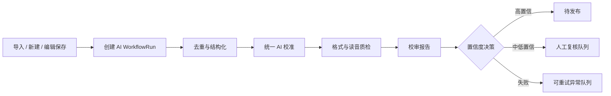

# 樗栎集 AI Native 全链路方案

## 背景

当前后台已经具备多项 AI 能力：单篇 AI 辅助、批量 AI 辅助、拼音校准、统一校准、重复检测、导入解析、校审报告等。但这些能力主要以“人工点按钮 + 浏览器等待 + 接口同步执行”的方式存在，导致三个问题：

1. 人工参与多：导入后需要人工选择文章、触发 AI、等待、再触发拼音、再校审。
2. 速度慢：批量任务串行或小批量执行，前端轮询并负责推进任务。
3. 可靠性弱：`batch-unified` 任务状态保存在内存中，刷新、部署、多实例或函数冷启动都会丢失。

目标不是再加几个 AI 按钮，而是把樗栎集管理改成“文章进入系统后，AI 自动完成可自动完成的部分，人只处理低置信度和发布决策”。

## 设计原则

- AI 默认在后台运行，不要求管理员盯着页面等待。
- 每一步都可观察、可重试、可回滚，不把 AI 当黑盒。
- 一次文章处理尽量合并模型调用，减少延迟和成本。
- 低风险字段自动写入，高风险事实进入复核队列。
- 先用现有 Prisma/Postgres 落地，不引入不必要的基础设施；当任务量增长后再切 Redis/专用队列。

## 目标体验

樗栎集导入或新建后，文章自动进入 AI 流水线：

1. 系统解析文章，生成结构化元数据。
2. 系统自动去重，精确重复直接跳过，相似重复进入复核。
3. 系统自动生成注释、译文、赏析、标签、拼音校准和格式分析。
4. 系统自动生成校审报告并给出发布风险等级。
5. 高置信度文章进入“待发布”，低置信度文章进入“待复核”。
6. 管理员只在樗栎集管理页处理异常、低置信度建议和最终发布。

## 当前能力盘点

已有可复用模块：

- `src/lib/ai-task.ts`：统一 LLM 调用、JSON 解析、日志写入。
- `src/lib/unified-calibration.ts`：一次 LLM 调用完成文学分析和拼音校准。
- `src/app/api/admin/articles/batch-unified/route.ts`：已有分片批处理雏形。
- `src/app/api/admin/articles/batch-ai-assist/route.ts`：批量 AI 辅助。
- `src/app/api/admin/articles/batch-pinyin-calibrate/route.ts`：批量拼音校准。
- `src/app/api/admin/articles/find-duplicates/route.ts` 和 `auto-dedup`：重复检测与自动择优。
- `src/app/admin/chuli/import/page.tsx`：批量导入入口。
- `AiTaskLog`：已有 AI 调用观测基础。

主要短板：

- 缺少持久化任务表和任务步骤表。
- 前端负责推进任务，后端不是自主 worker。
- 缺少文章级 AI 状态，例如 pending/running/review/passed/failed。
- 缺少置信度策略，无法区分自动写入、需复核、禁止发布。
- 缺少吞吐控制、并发池、重试、失败恢复和任务锁。

## 推荐架构

采用“持久化队列 + 工作流步骤 + 后台执行器”的方案。



后端新增两个核心概念：

- `AiWorkflowRun`：一次文章或批次的 AI 流水线。
- `AiWorkflowStep`：流水线中的每个步骤，记录状态、输入、输出、耗时、错误、重试次数。

管理员看到的是运行状态，不再等待单个请求完成。

## 数据模型建议

新增模型：

```prisma
model AiWorkflowRun {
  id          String   @id @default(cuid())
  articleId   String?
  batchId     String?
  source      String
  status      String   @default("queued")
  priority    Int      @default(0)
  policy      String   @default("standard")
  progress    Int      @default(0)
  confidence  Float?
  riskLevel   String?
  error       String?
  createdAt   DateTime @default(now())
  updatedAt   DateTime @updatedAt
  startedAt   DateTime?
  completedAt DateTime?

  @@index([status, priority, createdAt])
  @@index([articleId])
  @@index([batchId])
}

model AiWorkflowStep {
  id          String   @id @default(cuid())
  runId       String
  name        String
  status      String   @default("queued")
  order       Int
  attempt     Int      @default(0)
  maxAttempts Int      @default(3)
  input       String?
  output      String?
  error       String?
  durationMs  Int?
  aiLogId     String?
  createdAt   DateTime @default(now())
  updatedAt   DateTime @updatedAt

  @@index([runId, order])
  @@index([status, updatedAt])
}
```

在 `Article` 上补充派生状态：

```prisma
aiStatus      String?  // none | queued | running | review | ready | failed
aiConfidence  Float?
aiRiskLevel   String? // low | medium | high
aiUpdatedAt   DateTime?
```

这能让列表页直接筛选“AI 处理中 / 待复核 / 可发布 / 失败”。

## 流水线步骤

第一版建议固定 6 步：

1. `parse.normalize`：规范标题、体裁、日期、标签、空白和分段。
2. `dedupe.check`：重复检测；精确重复自动跳过，相似重复进入复核。
3. `article.unified-calibration`：复用 `runUnifiedCalibration`，一次模型调用生成注释、译文、赏析、标签、拼音校准。
4. `format.analyze`：复用现有格式分析能力，标记律绝、词牌、分段等问题。
5. `article.review`：生成校审报告，输出问题、建议、风险等级。
6. `decision.route`：根据置信度、错误和风险把文章路由到待发布、待复核或失败队列。

可选增强步骤：

- `painting.match`：当前批量自动配图已停用，建议恢复为“候选推荐”，不自动绑定。
- `quote.extract`：为每日名句生成候选。
- `seo.enrich`：生成摘要、搜索关键词和社交分享文案。

## 决策策略

建议用明确规则控制自动化边界：

| 条件 | 动作 |
| --- | --- |
| 精确重复 | 跳过，不创建新发布项 |
| 相似度 0.85 以上 | 进入人工复核 |
| AI 调用失败 | 自动重试，超过次数进入失败队列 |
| 注释少于 1 条且正文较长 | 进入人工复核 |
| 拼音 uncertain 大于 0 | 进入人工复核 |
| 校审报告 `risk` | 进入人工复核 |
| 综合置信度 >= 0.8 且无高风险 | 标记为待发布 |

发布仍由人确认；AI 负责把文章整理到“可发布状态”。

## 性能方案

短期：

- 把批量串行改为持久化队列并发执行，默认并发 3。
- 每篇优先使用 `runUnifiedCalibration`，减少“AI 辅助 + 拼音校准”两次模型调用。
- 为长文设置 chunk 策略：正文超过阈值时只对注释/拼音分块，赏析仍基于摘要和全文骨架。
- 对失败步骤做指数退避重试。

中期：

- 增加 provider 调度：快模型处理结构化和格式，强模型处理校审与疑难注释。
- 增加 prompt/result 缓存：同一文章内容哈希不重复请求。
- 将重复检测从 O(n²) 全量比较改为“标题哈希 + 正文 simhash/指纹 + 候选集比较”。

长期：

- 引入 Redis/BullMQ 或托管队列。
- 引入 embedding 检索，做跨文章典故、标签和重复候选召回。
- 引入流式状态更新，列表页实时显示每篇文章处理进度。

## 后台界面改造

樗栎集管理页新增 AI 工作台区域：

- 顶部统计：待处理、运行中、待复核、可发布、失败。
- 列表列新增：AI 状态、置信度、风险、最后处理时间。
- 批量动作改为：加入 AI 流水线、暂停、重试失败、只复核异常、发布高置信文章。
- 详情页新增“AI 轨迹”：展示每一步输入摘要、输出摘要、模型、耗时、错误和重试。

导入页改造：

- “解析并导入”后默认勾选“导入后自动进入 AI 流水线”。
- 导入结果不再只展示导入成功，而展示每篇的流水线状态入口。

## API 设计

新增接口：

- `POST /api/admin/ai-workflows`：创建单篇或批量流水线。
- `GET /api/admin/ai-workflows`：查询任务列表和聚合状态。
- `GET /api/admin/ai-workflows/[id]`：查看单个任务详情。
- `POST /api/admin/ai-workflows/[id]/retry`：重试失败步骤。
- `POST /api/admin/ai-workflows/worker`：执行一批 queued/running 步骤，可由 cron 或后台页面触发。
- `POST /api/admin/articles/[id]/ai-route`：单篇文章重新决策。

第一版 worker 可以由 Vercel Cron 或管理员页面触发；本地开发可以用脚本循环执行。

## 实施路线

### Phase 1：可靠性优先

- 新增 `AiWorkflowRun`、`AiWorkflowStep` 和文章 AI 状态字段。
- 把 `batch-unified` 从内存任务迁移到数据库任务。
- 新增 worker API，支持领取任务、锁定、执行、重试、记录步骤结果。
- 樗栎集列表展示 AI 状态和失败重试入口。

验收标准：刷新页面、服务重启或部署后，任务不会丢失；失败任务可重试。

### Phase 2：导入即自动处理

- 导入接口创建文章后自动创建 workflow。
- 新建/编辑保存后可自动或手动加入 workflow。
- 实现 `decision.route`，把文章分为待发布、待复核、失败。
- 列表增加“待复核”过滤。

验收标准：导入一批文章后，不需要逐篇点 AI 按钮；管理员只处理复核队列。

### Phase 3：速度优化

- worker 并发执行，默认 3，按 provider 限流。
- 结果缓存和内容哈希跳过重复处理。
- 重复检测改为候选集比较。
- 为长文增加分块处理策略。

验收标准：10 篇普通诗文可在数分钟内完成，且页面无需保持打开。

### Phase 4：质量闭环

- 在 AI 轨迹中沉淀“采纳/拒绝”反馈。
- 统计不同 prompt/provider 的成功率、平均耗时、复核率。
- 根据复核结果优化置信度规则和提示词。

验收标准：后台能看到 AI 的真实吞吐、成本、失败原因和人工复核负担。

## 风险与边界

- 不建议 AI 自动发布。古典文学注释、出处和异读有事实风险，自动发布会把错误直接暴露给读者。
- 不建议继续用内存任务承载生产批处理。当前实现适合原型，不适合稳定后台。
- 不建议把所有任务都交给最强模型。结构化、去重、格式分析可以用更快更便宜的模型或规则完成。
- 不建议让前端负责推进批处理。前端只应负责展示状态和发起控制命令。

## 下一步建议

先做 Phase 1。它改动范围清晰，收益最大：把慢、易丢、人工盯页面的问题先解决。完成后再把导入页和新建页接入自动流水线，樗栎集管理就会从“人工按钮集合”变成“AI 后台生产线”。
